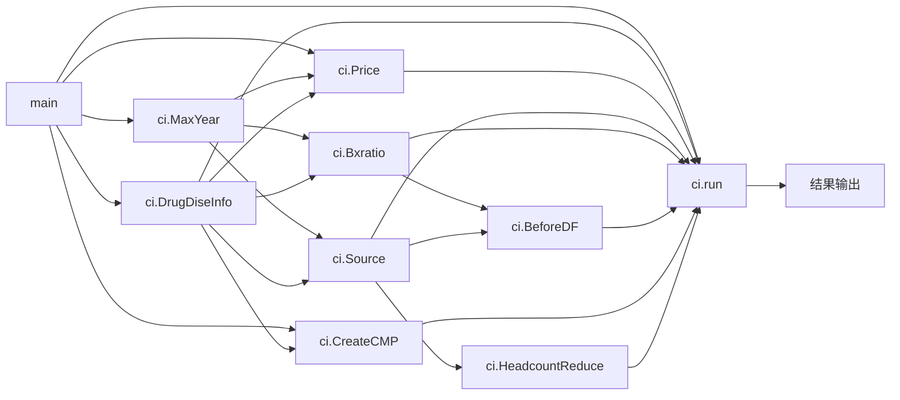
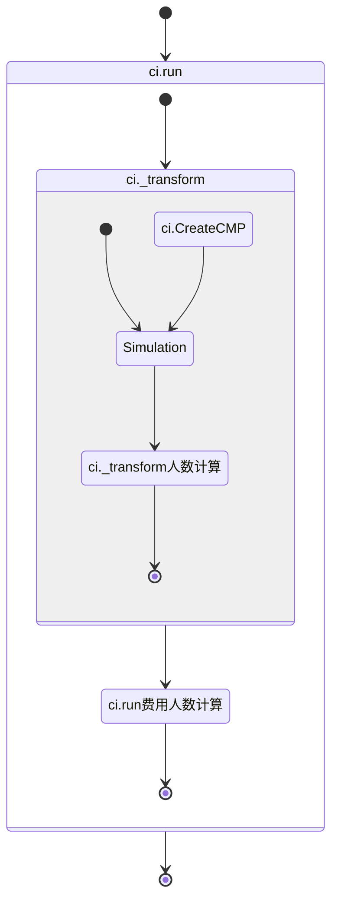
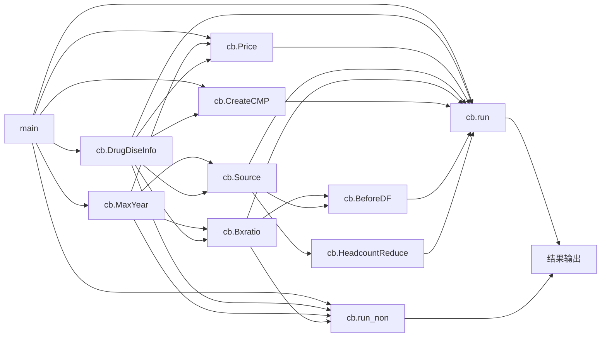
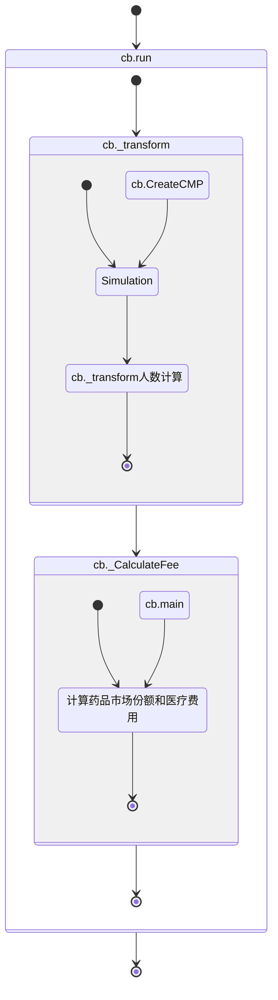

#
药品目录与招采模型说明文档

####
平安医疗健康管理股份有限公司

####
智能决策产品室

  
###
模型版本发布消息

|序列|发布日期|版本|发布人|修改原因|版本说明|需求方|通过日期|
|:-:|:-:|:-:|:-:|:-:|:-:|:-:|:-:|
|1|2020.08.06|v1.0|茆炜杰|NA|版本发布| |2020.08.06|

  
###目录
**1. 概述**
**2. 模型应用目的**
**3. 模型方法说明**
**4. 模型参数说明**
**5. 模型输出说明**
**6. 模型代码流程及函数输入输出**
   >**6.1 药品目录模拟模型流程图**
   >**6.2 药品招采模拟模型流程图**
   >**6.3 模型函数说明**

  
  

###1. 概述
药品目录模型是用于模拟药品医保目录变化后药品使用人数、医疗费用和基金支出的变化情况；药品招采模型是用于模拟药品带量采购的试点地区和非试点地区药品使用人数、医疗费用和基金支出的变化情况。
  
###2. 模型应用目的
对应国家局和省平台宏观决策部分药品目录影响模拟分析和药品招采影响模拟分析两个功能点。
  
###3. 模型方法说明
$d_1,d_2：测算药品，竞品药品$
$H：人数$
$P：概率$
$C：人均费用$
$F：费用$
####Step 1 统计现有药品用药人数
$\begin{cases}H_{d_1}=a\\H_{d_2}=b\\H_{oth}=c \end{cases}$
####Step 2 带入新增率$P_1$和转化率$P_2$计算变化后人数
$\begin{cases}H_{d_1}=a+P_1\cdot c+P_2 \cdot b\\H_{d_2}=(1-P_2)b\\H_{oth}=(1-P_1)c \end{cases}$
####Step 3 计算调整后医疗费用
$\begin{cases}F_{d_1}=H_{d_1}\cdot C_{d_1}\\F_{d_2}=H_{d_2}\cdot C_{d_2}\\F_{oth}=H_{oth}\cdot C_{oth}\end{cases}$
####Step 4 带入医保范围内比例$P_3$、报销比例$P_4$计算范围内费用$F_2$和基金支出$F_3$
$\begin{cases}F_1=F_{d_1}+F_{d_2}+F_{oth}\\F_2=F_1\cdot P_3\\F_3=F_2\cdot P_4 \end{cases}$
  
###4. 模型输入说明
**
药品招采模拟入参表ac_drug_bidprcu_para_inpt
**
|序号|字段名|中文含义|指标计算逻辑|数据来源|
|:-:|:-|:-|:-|:-|
|1|scen_id|场景id||前端用户输入|
|2|poolarea_no|统筹区|国家局到省粒度，省平台到市粒度||
|3|pilt_regn_flag|试点地区标志|||
|4|drug_genname_code|药品通用名|||
|5|prdr_codg|药品厂商名|||
|6|drug_bidprcu_cnt|药品招采数量|||
|7|drug_pric|药品单价|||
|8|nw_userat|新增使用率|||
|9|comp_eoc|竞品转化率|||
|10|nomdrug_pilt_regn_prcp|非中标药品试点地区价格变化比例|||
|11|nomregn_prcp|非试点地区价格变化比例|||

**
药品目录模拟入参表pol_drug_info_smlt_data_inpt
**
|序号|字段名|中文含义|指标计算逻辑|数据来源|
|:-:|:-|:-|:-|:-|
|1|scen_id|场景id||前端用户输入|
|2|poolarea_no|统筹区|国家局到省粒度，省平台到市粒度||
|3|drug_codg|药品通用名|||
|4|hi_pay_std|医保支付标准|||
|5|hi_pay_prop|医保支付比例|||
|6|nw_patn_eoc|新增使用率|||
|7|comp_eoc|竞品转化率|||

**
modl_drug_medins_mdtrt_fee
**
|序号|字段名|中文含义|指标计算逻辑|数据来源|
|:-:|:-|:-|:-|:-|
|1|poolarea|统筹区||结算信息明细|
|2|stt_year|统计年份|||
|3|medinslv|医疗机构等级|一级及一下、二级、三级||
|4|mdtrt_type|就诊类型|门诊、住院||
|5|disecode|疾病编码|||
|6|med_fee|医疗费用|医疗费用汇总||
|7|hi_scp_in_fee|医保范围内费用|医保范围内费用汇总||
|8|fund_pay|基金支出|基金支出汇总||

**
modl_drug_medins_drug_fee
**
|序号|字段名|中文含义|指标计算逻辑|数据来源|
|:-:|:-|:-|:-|:-|
|1|poolarea|统筹区||费用信息明细、医保目录信息|
|2|stt_year|统计年份|||
|3|medinslv|医疗机构等级|一级及一下、二级、三级||
|4|mdtrt_type|就诊类型|门诊、住院||
|5|disecode|疾病编码|||
|6|drug_genname_codg|药品通用名编码|||
|7|drug_codg|药品厂商编码|||
|8|psn_codg|人员编码|||
|9|med_fee|医疗费用|医疗费用汇总||
|10|hi_scp_in_fee|医保范围内费用|医疗费用汇总*药品甲乙类范围内比例||
|11|drug_act_useamt|药品实际使用量|药品实际使用量汇总||

**
dim_mds_drug_genname_codg
**
|序号|字段名|中文含义|指标计算逻辑|数据来源|
|:-:|:-|:-|:-|:-|
|1|drug_genname_codg|药品通用名编码|||
|2|comp_drug_genname_codg|竞品药品通用名编码|||

**
dim_mds_drug_genname_disecode
**
|序号|字段名|中文含义|指标计算逻辑|数据来源|
|:-:|:-|:-|:-|:-|
|1|drug_gennmae_codg|药品通用名编码|||
|2|disecode|疾病编码|||

**
modl_drug_psn_medc_labl
**
|序号|字段名|中文含义|指标计算逻辑|数据来源|
|:-:|:-|:-|:-|:-|
|1|poolarea|统筹区||费用信息明细、dim_mds_drug_genname_codg、dim_mds_drug_genname_disecode|
|2|stt_year|统计年份|||
|3|medinslv|医疗机构等级|一级及一下、二级、三级||
|4|mdtrt_type|就诊类型|门诊、住院||
|5|psn_codg|人员编码|||
|6|medc_drug_labl|用药药品标签(药品通用名)|基于药品-疾病对应关系，为人员id用药情况打上标签||
|7|avl_drug_labl|可用药品标签(药品通用名)|基于药品-竞品、药品-疾病对应关系，为人员id可能用药情况打上标签||

**
modl_drug_medc_ave_pric
**
|序号|字段名|中文含义|指标计算逻辑|数据来源|
|:-:|:-|:-|:-|:-|
|1|poolarea|统筹区||费用信息明细、医保目录信息|
|2|stt_year|统计年份|||
|3|medinslv|医疗机构等级|一级及一下、二级、三级||
|4|mdtrt_type|就诊类型|门诊、住院||
|5|drug_genname_codg|药品通用名编码|||
|6|drug_codg|药品厂商编码|||
|7|prod_gran_medc_psncnt|产品粒度用药人数|人数统计，同一药品通用名下使用N钟产品的人记1\/N人||
|8|medc_psncnt_prop|用药人数占比|产品粒度用药人数/通用名粒度用药人数；占比和为1||
|9|ave_drug_pric|平均药品单价|药品医疗费用/产品粒度用药人数||
|10|ave_scp_in_drug_pric|平均范围内药品单价|药品范围内费用/产品粒度用药人数||
|11|perpsn_drug_dos|人均药品用量|药品实际使用量/产品粒度用药人数||

  
###5. 模型输出说明

**
药品目录模拟结果输出表ac_druglist_modl_oupt
**
|序号|字段名|中文含义|指标计算逻辑|数据来源|
|:-:|:-|:-|:-|:-|
|1|scen_id|场景id||模型输出|
|2|poolarea|统筹区|||
|3|medinslv|医疗机构等级|||
|4|mdtrt_type|就诊类型|||
|5|medc_flag|是否用药标签|||
|6|est_old_psncnt|测算前人数|||
|7|est_new_psncnt|测算后人数|||
|8|est_old_med_fee|测算前医疗费用|||
|9|est_new_med_fee|测算后医疗费用|||
|10|est_old_scp_in_fee|测算前范围内费用|||
|11|est_new_scp_in_fee|测算后范围内费用|||
|12|est_old_fund_pay|测算前基金支出|||
|13|est_new_fund_pay|测算后基金支出|||

**
药品招采模拟结果输出表ac_drug_bidprcu_modl_oupt
**
|序号|字段名|中文含义|指标计算逻辑|数据来源|
|:-:|:-|:-|:-|:-|
|1|scen_id|场景id||模型输出|
|2|poolarea|统筹区|||
|3|makexp_regn_flag|试点地区标志|||
|4|medinslv|医疗机构等级|||
|5|mdtrt_type|就诊类型|||
|6|medc_flag|是否用药标签|||
|7|est_old_psncnt|测算前人数|||
|8|est_new_psncnt|测算后人数|||
|9|est_old_med_fee|测算前医疗费用|||
|10|est_new_med_fee|测算后医疗费用|||
|11|est_old_scp_in_fee|测算前范围内费用|||
|12|est_new_scp_in_fee|测算后范围内费用|||
|13|est_old_fund_pay|测算前基金支出|||
|14|est_new_fund_pay|测算后基金支出|||

  
###6. 模型代码流程及函数输入输出
####6.1 药品目录模拟模型流程图
CalculateIndex类简写为ci

####6.2 药品招采模拟模型流程图
CalculateBidding类简写为cb

####6.3 模型函数说明
**两个模型中存在部分函数复用情况，会在函数说明内具体说明**
####6.3.1 药品目录模拟模型main函数
说明：从药品目录模拟入参表pol_drug_info_smlt_data_inpt获取用户前端输入参数
函数输入项：scen_id,poolarea_no
函数输出项：
|序号|字段名|中文含义|
|:-:|:-|:-|
|1|scen_id|场景id|
|2|poolarea_no|统筹区|
|3|drug_codg|药品通用名|
|4|hi_pay_std|医保支付标准|
|5|hi_pay_prop|医保支付比例|
|6|nw_patn_eoc|新增使用率|
|7|comp_eoc|竞品转化率|
####6.3.2 药品招采模拟模型main函数
说明：从药品招采模拟入参表ac_drug_bidprcu_para_inpt获取用户前端输入参数
函数输入项：scen_id,poolarea_no
函数输出项：
|序号|字段名|中文含义|
|:-:|:-|:-|
|1|scen_id|场景id|
|2|poolarea_no|统筹区|
|3|pilt_regn_flag|试点地区标志|
|4|drug_genname_code|药品通用名|
|5|prdr_codg|药品厂商名|
|6|drug_bidprcu_cnt|药品招采数量|
|7|drug_pric|药品单价|
|8|nw_userat|新增使用率|
|9|comp_eoc|竞品转化率|
|10|nomdrug_pilt_regn_prcp|非中标药品试点地区价格变化比例|
|11|nomregn_prcp|非试点地区价格变化比例|
####6.3.3 药品目录模拟模型ci.DrugDiseInfo函数
说明：从dim_mds_drug_genname_codg、dim_mds_drug_genname_disecode表中获得测算药品对应竞品和疾病信息
函数输入项：药品通用名
函数输出项：
|序号|字段名|中文含义|
|:-:|:-|:-|
|1|drug_genname_codg|药品通用名编码|
|2|disecode|疾病编码|
####6.3.4 药品招采模拟模型cb.DrugDiseInfo函数
说明：从dim_mds_drug_genname_disecode表中获得测算药品对应疾病信息
函数输入项：药品通用名
函数输出项：
|序号|字段名|中文含义|
|:-:|:-|:-|
|1|drug_genname_codg|药品通用名编码|
|2|disecode|疾病编码|
####6.3.5 ci.CreateCMP函数和cb.CreateCMP函数
说明：该函数通用
函数输入项：
|序号|字段名|中文含义|
|:-:|:-|:-|
|1|poolarea_no|统筹区|
|2|drug_genname_codg|药品通用名编码|
|3|nw_userat|新增使用率|
|4|comp_eoc|竞品转化率|

|序号|字段名|中文含义|
|:-:|:-|:-|
|1|drug_genname_codg|药品通用名编码|
|2|disecode|疾病编码|
函数输出项：
{'320100':{'2':{'1':{'new':0.1},'4':{'tf':0.3}}}}
'tf'代表转化率，适用于药品竞品关系；'new'代表新增率，适用于药品非竞品关系。
含义：320100地区，使用药品1的人有10%可新增使用药品2，使用药品4的人有30%可转化使用药品2。

####6.3.6 ci.MaxYear函数和cb.MaxYear函数
说明：从modl_drug_medins_mdtrt_fee获取统筹区最新年份，以该年份的数据作为测算基础。
函数输入项：poolarea_no
函数输出项：{'320100':2017}

####6.3.7 ci.Source函数和cb.Source函数
说明：modl_drug_medins_drug_fee left join modl_drug_psn_medc_labl 创建一张临时表，筛选年份、疾病，为每个人关联上用药药品标签和可用药品标签，聚合计算人数；同时统计除测算药品外其他医疗项目的人均费用。
函数输入项：MaxYear函数输出项{'320100':2017}
|序号|字段名|中文含义|
|:-:|:-|:-|
|1|drug_genname_codg|药品通用名编码|
|2|disecode|疾病编码|
函数输出项：
|序号|字段名|中文含义|
|:-:|:-|:-|
|1|poolarea|统筹区|
|2|medinslv|医疗机构等级|
|3|mdtrt_type|就诊类型|
|4|medc_drug_labl|用药药品标签|
|5|avl_drug_labl|可用药品标签|
|6|hc|人数|
|7|htc_other|除测算药品外其他医疗项目的人均费用|
|8|hcc_other|除测算药品外其他医疗项目的人均范围内费用|
用药药品标签和可用药品标签会进行缩减，只保留需测算的药品

####6.3.8 ci.BxRatio函数和cb.BxRatio函数
说明：modl_drug_medins_mdtrt_fee筛选年份和疾病，计算历史报销比例
函数输入项：MaxYear函数输出项{'320100':2017}
|序号|字段名|中文含义|
|:-:|:-|:-|
|1|drug_genname_codg|药品通用名编码|
|2|disecode|疾病编码|
函数输出项：
|序号|字段名|中文含义|
|:-:|:-|:-|
|1|poolarea|统筹区|
|2|medinslv|医疗机构等级|
|3|mdtrt_type|就诊类型|
|4|bx_ratio|报销比例|

####6.3.9 ci.BeforeDF函数和cb.BeforeDF函数
说明：从Source临时表中取数，筛选年份、疾病，计算现有数据的人数（用药人数和非用药人数）、医疗费用、范围内费用和基金支出。
函数输入项：BxRatio函数输出项
|序号|字段名|中文含义|
|:-:|:-|:-|
|1|poolarea|统筹区|
|2|medinslv|医疗机构等级|
|3|mdtrt_type|就诊类型|
|4|bx_ratio|报销比例|
函数输出项：
|序号|字段名|中文含义|
|:-:|:-|:-|
|1|poolarea|统筹区|
|2|medinslv|医疗机构等级|
|3|mdtrt_type|就诊类型|
|4|scope|是否用药标签|
|5|tc_before|测算前费用|
|6|cc_before|测算前范围内费用|
|7|fp_before|测算前基金支出|
|8|hc_before|测算前人数|

####6.3.10 ci.HeadcountReduce函数和cb.HeadcountReduce函数
说明：从Source临时表中取数，筛选年份、疾病，计算人数调整系数，用于调整后人数聚合计算
函数输入项：暂无
函数输出项：
|序号|字段名|中文含义|
|:-:|:-|:-|
|1|poolarea|统筹区|
|2|medinslv|医疗机构等级|
|3|mdtrt_type|就诊类型|
|4|scope|是否用药标签|
|5|tc_before|测算前费用|
|6|cc_before|测算前范围内费用|
|7|fp_before|测算前基金支出|
|8|hc_before|测算前人数|

####6.3.11 药品目录模拟模型ci.Price函数
说明：从modl_drug_medc_ave_pric筛选年份和药品，结合参数输入的医保支付标准和医保支付比例计算得出药品人均费用和人均范围内费用。
函数输入项：MaxYear函数输出项{'320100':2017}
|序号|字段名|中文含义|
|:-:|:-|:-|
|1|drug_genname_codg|药品通用名编码|
|2|disecode|疾病编码|

|序号|字段名|中文含义|
|:-:|:-|:-|
|1|drug_codg|药品通用名|
|2|hi_pay_std|医保支付标准|
|3|hi_pay_prop|医保支付比例|
函数输出项：
|序号|字段名|中文含义|
|:-:|:-|:-|
|1|poolarea|统筹区|
|2|medinslv|医疗机构等级|
|3|mdtrt_type|就诊类型|
|4|drug_genname_codg|药品通用名编码|
|5|htc|药品人均费用|
|6|hcc|药品人均范围内费用|

####6.3.12 药品招采模拟模型ci.Price函数
说明：从modl_drug_medc_ave_pric筛选年份和药品，结合参数输入的药品单价、价格降幅等参数调整计算得出平均单价、平均范围内药品单价、用药人数占比和人均药品用量。
函数输入项：MaxYear函数输出项{'320100':2017}
|序号|字段名|中文含义|
|:-:|:-|:-|
|1|drug_genname_codg|药品通用名编码|
|2|disecode|疾病编码|

|序号|字段名|中文含义|
|:-:|:-|:-|
|1|drug_genname_code|药品通用名|
|2|prdr_codg|药品厂商名|
|3|drug_pric|药品单价|
|4|nomdrug_pilt_regn_prcp|非中标药品试点地区价格变化比例|

函数输出项：
|序号|字段名|中文含义|
|:-:|:-|:-|
|1|poolarea|统筹区|
|2|medinslv|医疗机构等级|
|3|mdtrt_type|就诊类型|
|4|drug_genname_codg|药品通用名编码|
|5|drug_codg|药品厂商名|
|6|ave_drug_pric|平均药品单价|
|7|ave_scp_in_drug_pric|平均范围内药品单价|
|8|medc_psncnt_prop|用药人数占比|
|9|perpsn_drug_dos|人均药品用量|

####6.3.13 ci._transform函数和cb._transform函数
说明：基于Simulation函数结果，计算转化后人数
函数输入项：Source函数输出项
|序号|字段名|中文含义|
|:-:|:-|:-|
|1|poolarea|统筹区|
|2|medinslv|医疗机构等级|
|3|mdtrt_type|就诊类型|
|4|medc_drug_labl|用药药品标签|
|5|avl_drug_labl|可用药品标签|
|6|hc|人数|
CreateCMP函数输出项，{'320100':{'2':{'1':{'new':0.1},'4':{'tf':0.3}}}}
函数输出项：
|序号|字段名|中文含义|
|:-:|:-|:-|
|1|poolarea|统筹区|
|2|medinslv|医疗机构等级|
|3|mdtrt_type|就诊类型|
|4|medc_drug_labl|用药药品标签|
|5|avl_drug_labl|可用药品标签|
|6|1_2|转化后药品标签1_2的人数|
|7|2_3|转化后药品标签2_3的人数|
|...|...|...|

####6.3.14 Simulation函数
说明：调整转化率，确定多药品转化时重叠部分
函数输入项：
{'1':['new',0.5,{'2'}],'3':['tf',0.7,{'2'}]}
'tf'代表转化率，适用于药品竞品关系；'new'代表新增率，适用于药品非竞品关系。
含义：使用药品1的人有50%可新增使用药品2，使用药品3的人有70%可转化使用药品2。
函数输出项：
{'1_3':['tf',0.2,{'2'},'1':['new',0.3,{'2'}],'3':['tf',0.5,{'2'}]}

####6.3.15 cb._CalculateFee函数
说明：结合转化后用药标签和对应人数、参数输入的药品招采数量、竞品转化率和Price函数结果，计算得出医疗费用和范围内费用。
|序号|字段名|中文含义|
|:-:|:-|:-|
|1|drug_genname_code|药品通用名|
|2|prdr_codg|药品厂商名|
|3|drug_bidprcu_cnt|药品招采数量|
|4|comp_eoc|竞品转化率|

|序号|字段名|中文含义|
|:-:|:-|:-|
|1|poolarea|统筹区|
|2|medinslv|医疗机构等级|
|3|mdtrt_type|就诊类型|
|4|drug_genname_code|药品通用名|
|5|hc|人数|

函数输出项：
|序号|字段名|中文含义|
|:-:|:-|:-|
|1|poolarea|统筹区|
|2|medinslv|医疗机构等级|
|3|mdtrt_type|就诊类型|
|4|drug_genname_code|药品通用名|
|5|tc|医疗费用|
|6|cc|医保范围内费用|

####6.3.16 cb.run_non函数
说明：从modl_drug_medins_drug_fee筛选年份、疾病，计算现有数据的人数（用药人数和非用药人数）、医疗费用、范围内费用和基金支出；结合参数输入的非试点地区价格变化比例计算测算后对应数据
函数输入项：MaxYear函数输出项{'320100':2017}
|序号|字段名|中文含义|
|:-:|:-|:-|
|1|poolarea|统筹区|
|2|medinslv|医疗机构等级|
|3|mdtrt_type|就诊类型|
|4|bx_ratio|报销比例|

|序号|字段名|中文含义|
|:-:|:-|:-|
|1|drug_genname_codg|药品通用名编码|
|2|disecode|疾病编码|

|序号|字段名|中文含义|
|:-:|:-|:-|
|1|poolarea_no|统筹区|
|2|drug_genname_code|药品通用名|
|3|nomregn_prcp|非试点地区价格变化比例|

函数输出项：
|序号|字段名|中文含义|
|:-:|:-|:-|
|1|scen_id|场景id|
|2|poolarea|统筹区|
|3|medinslv|医疗机构等级|
|4|mdtrt_type|就诊类型|
|5|medc_flag|是否用药标签|
|6|est_old_psncnt|测算前人数|
|7|est_new_psncnt|测算后人数|
|8|est_old_med_fee|测算前医疗费用|
|9|est_new_med_fee|测算后医疗费用|
|10|est_old_scp_in_fee|测算前范围内费用|
|11|est_new_scp_in_fee|测算后范围内费用|
|12|est_old_fund_pay|测算前基金支出|
|13|est_new_fund_pay|测算后基金支出|